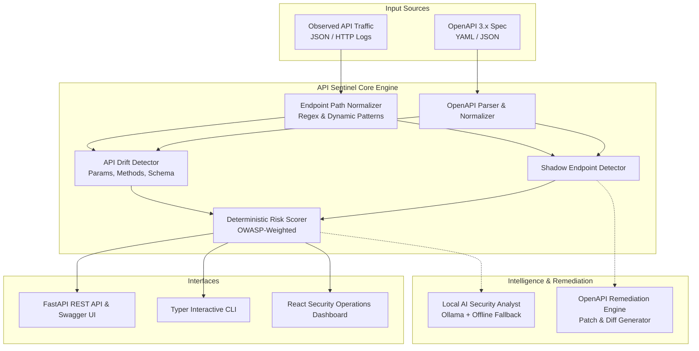

# API Sentinel Architecture

API Sentinel is an open-source cybersecurity tool designed to detect **API Drift** and **Shadow Endpoints** by comparing declared OpenAPI specifications with observed production/staging traffic.

It targets **OWASP API Security Top 10 (2023)**:
- **API9: Improper Inventory Management**: Lack of visibility into endpoints, deprecated versions, and undocumented parameters.
- **API8: Security Misconfiguration**: Unauthenticated debug endpoints, exposed admin interfaces, and schema leakage.

---

## High-Level Architecture

---

## Component Breakdown

### 1. Specification Parser (`backend/app/services/openapi_parser.py`)
- Ingests OpenAPI 3.0 / 3.1 definitions in YAML or JSON format.
- Resolves schema definitions, path templates, expected HTTP methods, query parameters, request bodies, and authentication security requirements.
- Converts the spec into a normalized internal data representation (`NormalizedSpec`).

### 2. Path Normalization Service (`backend/app/services/normalizer.py`)
- Maps observed concrete paths (e.g. `/users/42`, `/orders/b9f1a0e1-4c6e-41d3-a442-8877bc954378`) to parameterized route templates (`/users/{id}`, `/orders/{id}`).
- Uses two-phase matching:
  1. Direct template matching against declared OpenAPI routes.
  2. Dynamic heuristic matching (numeric IDs, UUIDs, hex object IDs) avoiding false positives on known keywords.

### 3. Shadow Endpoint Detector (`backend/app/detectors/shadow_detector.py`)
- Compares observed traffic endpoints against the normalized declared specification.
- Flags endpoints that receive real traffic but do not exist in the specification.
- Distinguishes between completely missing endpoints (e.g., `GET /admin/users`, `GET /debug`) and method discrepancies.

### 4. API Drift Detector (`backend/app/detectors/drift_detector.py`)
- Analyzes documented endpoints for deviations:
  - **Undocumented HTTP Methods**: e.g., `POST /users` when only `GET /users` is defined.
  - **Parameter Drift**: Query parameters present in traffic but missing from specification.
  - **Schema Drift**: Extra fields in request bodies (e.g. unexpected `coupon` or `role` fields).
  - **Authentication Drift**: Endpoints flagged as requiring auth receiving traffic without credentials.

### 5. Risk Scorer (`backend/app/detectors/risk_scorer.py`)
- A 100% deterministic, rule-based scoring engine.
- Assigns severity scores (0–100) based on endpoint sensitivity, authentication presence, and OWASP impact.
- Calculates an aggregate risk score and categorization (`CLEAN`, `LOW`, `MEDIUM`, `HIGH`, `CRITICAL`).

### 6. Local AI Analyst & Deterministic Fallback (`backend/app/ai/ollama_client.py`)
- Queries a local Ollama instance (e.g., Gemma 2B, Llama 3) for deep security insights.
- **Fail-Safe Guarantee**: If Ollama is offline or not installed, the engine seamlessly switches to a rule-based deterministic security advisor with zero user disruption.
- Does **not** delegate detection truth to the LLM; the LLM only assists with explanations and remediation advice.

### 7. Remediation Engine (`backend/app/services/remediation.py`)
- Generates suggested OpenAPI 3.0 patches in YAML for detected shadow endpoints or missing parameters.
- Never mutates the user's files without explicit consent.
